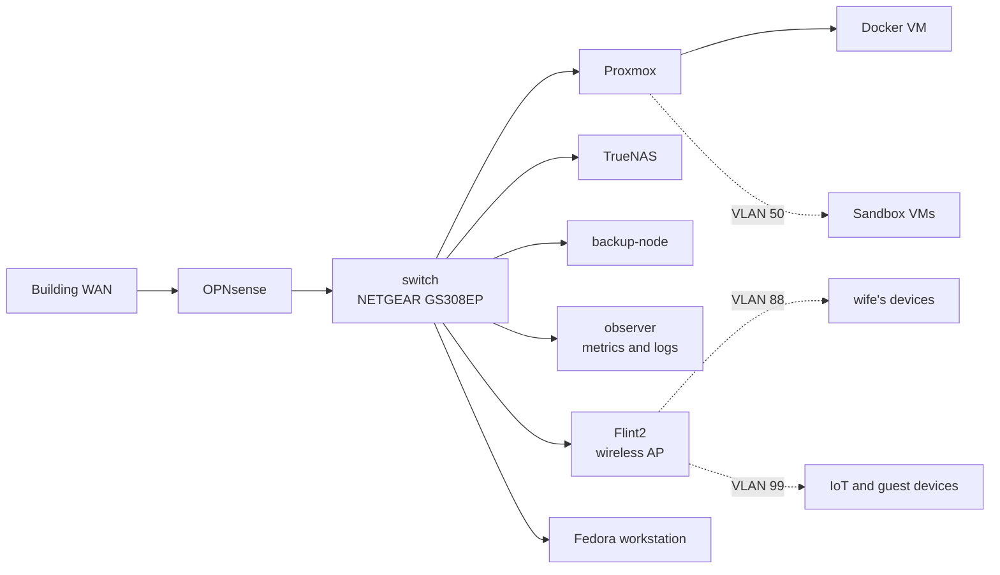

# Homelab Architecture

This folder documents the current architecture of Marco's homelab. It describes the
network boundaries, physical topology, security controls, and service placement that
are intended to be true of the running environment.

## At A Glance

- **WAN edge:** Building-managed internet connection terminates on OPNsense.
- **Routing and policy:** OPNsense provides routing, DHCP, DNS, firewalling, and IDS.
- **Switching:** A NETGEAR GS308EP carries the VLANs and provides PoE+ for both Raspberry Pis.
- **Compute:** Proxmox hosts the Docker VM and other virtual machines.
- **Storage:** TrueNAS provides SMB and NFS storage on the management network.
- **Observability:** observer collects metrics and logs; the Docker VM hosts Grafana and applications.
- **Remote access:** Tailscale provides controlled access without a public address.

## Documents

- [Network Topology](network-topology.md) covers physical links, VLANs, addressing, and switch ports.
- [Security Architecture](security-architecture.md) covers trust boundaries, firewall policy, administration, and remote access.
- [Service Architecture](service-architecture.md) covers service placement, storage dependencies, monitoring, and backups.

## Current-State Diagram

## Historical Reference

The original diagram is retained for reference because it documents an earlier stage of
the lab. The current written topology is maintained in [Network Topology](network-topology.md).

