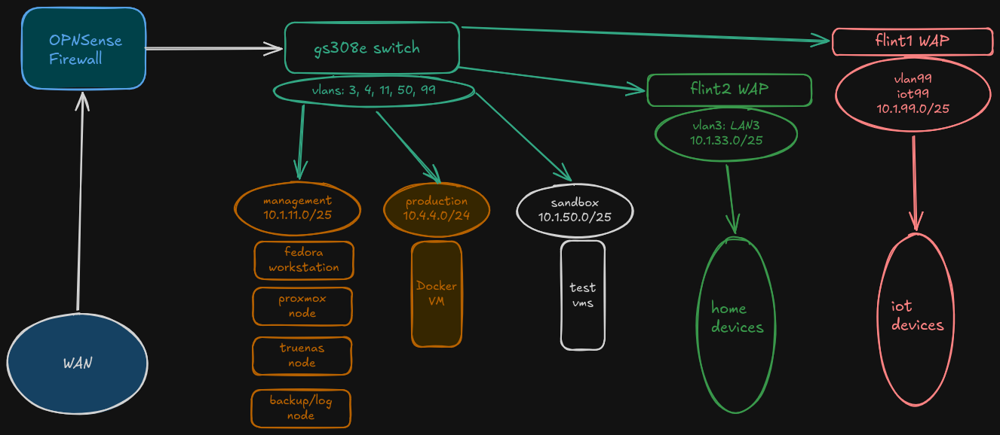

## Network Diagram
showing WAN path through my router to the switch,  
then splitting off into each vlan/subnet.  
The physical connections to the switch are as follows;  
- OPNsense node LAN connection, connected to trunked port, all vlans tagged
- flint1 as wireless access point, connected to access port for vlan99 IOT
- flint2 as wireless access point, connected to access port for vlan3 LAN3
- Proxmox node connected to trunked port, all vlans tagged
- Truenas node connected to access port for vlan11 management
- Backup-node(raspi4) connected to access port for vlan 11 management
- Workstation(izzy) connected to access port for vlan 11 management
