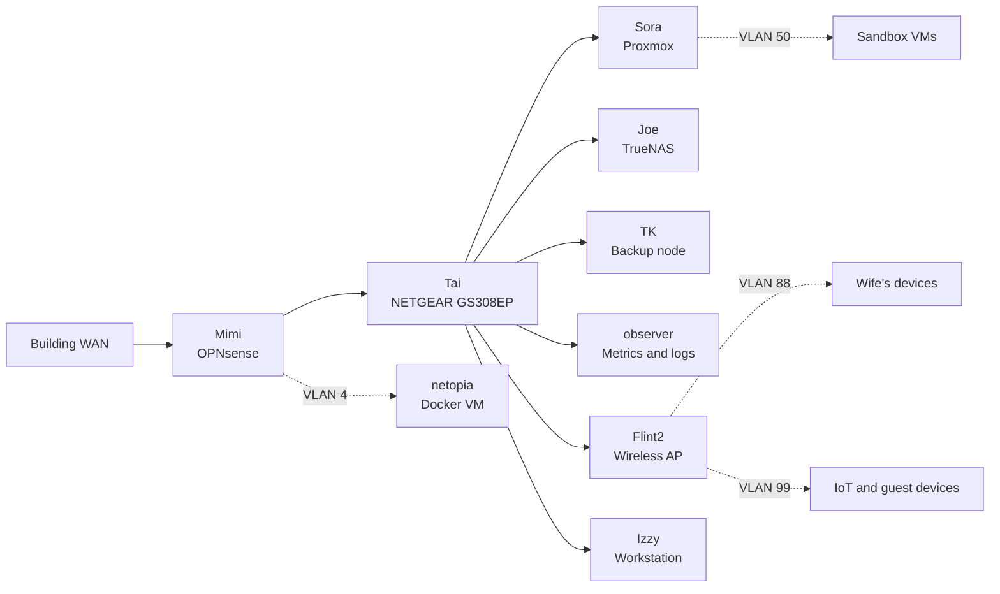

## Network Diagram
showing WAN path through my router to the switch,  
then splitting off into each vlan/subnet.  
The physical connections to Tai are as follows;  
- Mimi LAN connection, connected to a trunked port with VLANs 4, 11, 50, 88, and 99 tagged
- Flint2 as the wireless access point, connected to an access port with VLANs 88 and 99 tagged
- Sora connected to a trunked port with VLANs 1, 4, 50, 88, and 99 tagged
- Joe connected to an access port for VLAN 11 management
- TK connected to an access port for VLAN 11 management
- observer connected to an access port for VLAN 11 management
- Izzy connected to an access port for VLAN 11 management

