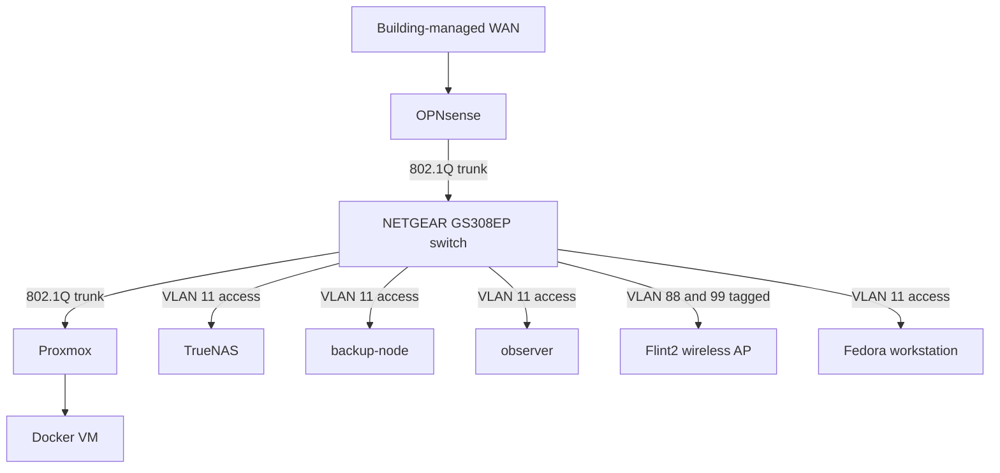

# Network Topology

## Traffic Flow

The building-managed WAN connection enters OPNsense. OPNsense is the default gateway for the homelab and forwards LAN traffic to the NETGEAR GS308EP switch. The switch distributes access and tagged VLAN connectivity to the physical nodes and Flint2 wireless access point.

## VLANs And Addressing

| VLAN | Name | Network | Primary purpose |
| --- | --- | --- | --- |
| 1 | LAN | `192.168.33.0/25` | Native LAN, switch management, and Flint2 management |
| 4 | Production | `10.4.4.0/24` | Docker VM and production workloads |
| 11 | Management | `10.1.11.0/25` | TrueNAS, Proxmox, Raspberry Pis, and administration |
| 50 | Sandbox | `10.1.50.0/25` | Isolated testing and sandbox VMs; DHCP assigned |
| 88 | Wife's LAN | `10.1.88.0/25` | Wife's devices and latency-sensitive devices |
| 99 | IoT | `10.1.99.0/25` | Smart-home and guest devices |

## Switch Port Layout

The following table is the current physical layout on the switch. `PVID` is the untagged/native VLAN for the port; the tagged list contains VLANs carried with 802.1Q tags.

| Port | Connected device | PVID | Tagged VLANs |
| --- | --- | --- | --- |
| 1 | TrueNAS | 11 | None |
| 2 | Proxmox | 11 | 1, 4, 50, 88, 99 |
| 3 | backup-node | 11 | None |
| 4 | Unused | 50 | None |
| 5 | Unused | 50 | None |
| 6 | observer | 11 | None |
| 7 | OPNsense LAN | 1 | 4, 11, 50, 88, 99 |
| 8 | Flint2 | 1 | 88, 99 |

## Physical Nodes

- **OPNsense:** NUC7i5BNK firewall and router. The native NIC connects to the switch; the Realtek Ugreen 2.5GbE USB NIC connects to WAN.
- **Proxmox:** ThinkCentre M75q Gen2 virtualization host.
- **TrueNAS:** ThinkCentre M715q Gen2 network-attached storage host.
- **backup-node:** Raspberry Pi 4 used for backups.
- **observer:** Raspberry Pi 4 used for metrics and log collection.
- **Flint2:** GL.iNet Flint MT6000 running OpenWrt in access point mode.
- **switch:** NETGEAR GS308EP managed switch with PoE+.
