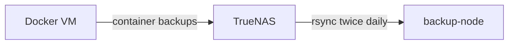
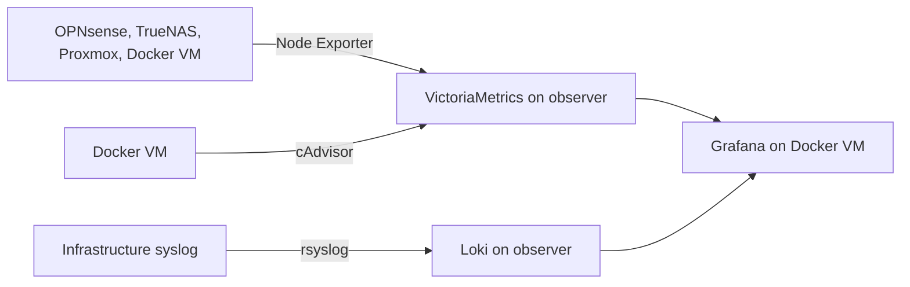

# Service Architecture

## Service Placement

| Component | Host | Network or location | Role |
| --- | --- | --- | --- |
| OPNsense services | OPNsense | VLANs 1, 4, 11, 50, 88, 99 | Routing, DHCP, DNS, firewalling, and IDS |
| Docker workloads | Docker VM | Production VLAN 4 | Self-hosted applications and web services |
| Grafana | Docker VM | Production VLAN 4 | Dashboards and visualization |
| cAdvisor | Docker VM | Docker VM | Container metrics |
| Node Exporter | OPNsense, TrueNAS, Proxmox, Docker VM | Respective node networks | Host metrics |
| VictoriaMetrics | observer | Management VLAN 11 | Metrics storage and scraping |
| Loki and Promtail | observer | Management VLAN 11 | Log storage and collection |
| Nginx Proxy Manager | Docker VM | Production VLAN 4 | TLS termination and reverse proxy |
| Uptime Kuma | Docker VM | Production VLAN 4 | Availability monitoring and Discord alerts |
| TrueNAS SMB and NFS | TrueNAS | Management VLAN 11 | Network storage |

## Application Services

The Docker VM currently runs:

- AdGuard
- Gitea
- Immich
- LibreSpeed
- iPerf3
- Memos
- Nginx Proxy Manager
- StirlingPDF
- Uptime Kuma
- Vaultwarden
- Grafana
- cAdvisor
- Node Exporter

## Storage Relationships

TrueNAS provides two documented storage areas:

- `/mnt/TANK/NASgul` is the SMB share for general file storage.
- `/mnt/TANK/nfs` is the NFS share used by the Docker VM for container backups and application data where required.

The Docker VM has SMB and NFS mounts configured through `/etc/fstab`. Other nodes use the SMB share where needed. Credentials for SMB mounts are stored in a root-only credentials file rather than directly in `/etc/fstab`.

## Backup Flow

The Docker VM backs up its container data to TrueNAS. backup-node performs rsync backups of TrueNAS shares twice daily. This provides local redundancy across separate systems, while an off-site copy remains a future improvement.

## Monitoring Flow

observer is the monitoring and logging collector. Grafana remains the user-facing dashboard on the Docker VM. Uptime Kuma separately checks service availability and sends Discord alerts.

## Dependencies

- Applications depend on OPNsense for network routing and DNS.
- Web applications depend on Nginx Proxy Manager for internal names and TLS.
- The Docker VM depends on TrueNAS for documented NFS-backed data and backups.
- Grafana depends on VictoriaMetrics and Loki for monitoring data.
- backup-node depends on TrueNAS shares being available when its scheduled rsync runs.
