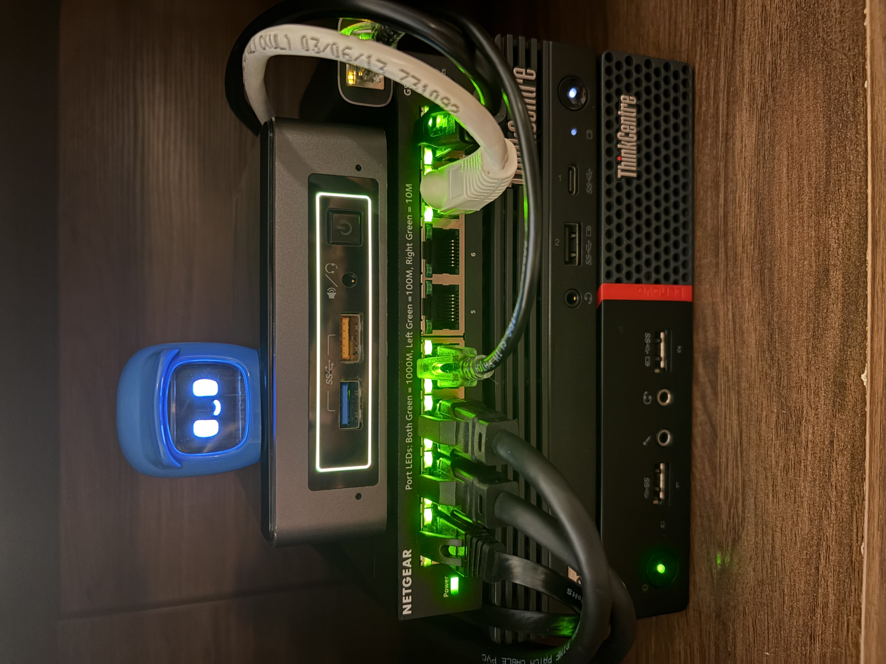
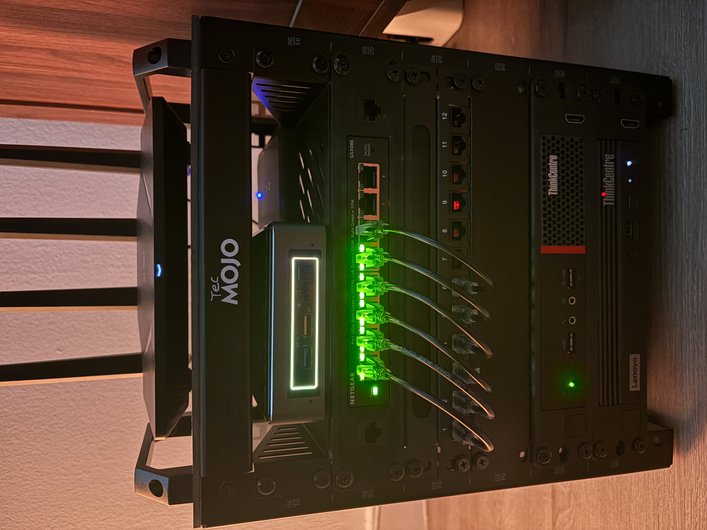
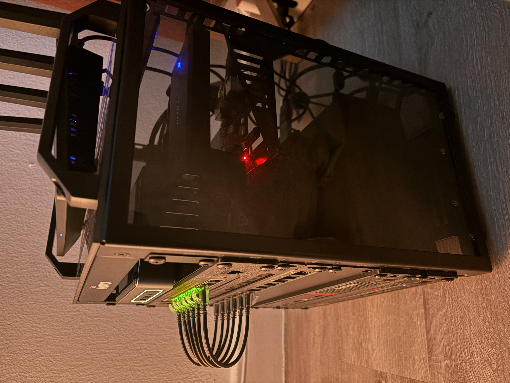
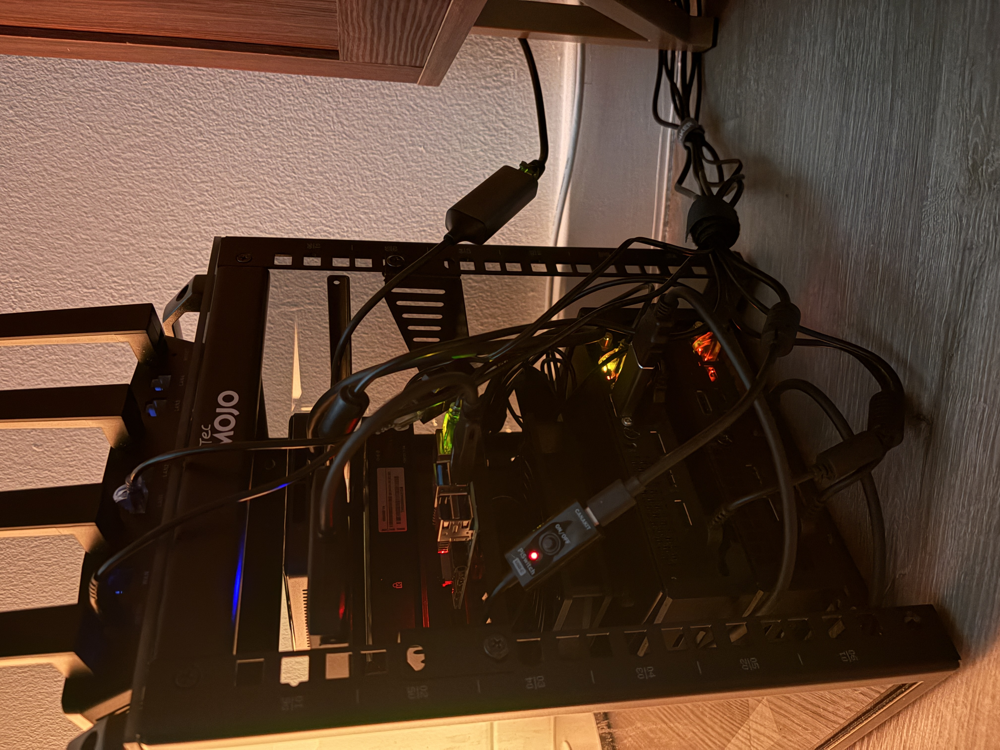

## these are the physical nodes from the top to the bottom:
- nuc7i5BNK + realtek8156b USB NIC (gateway/firewall)
- Netgear gs308e (managed switch)
- Thinkcenter tiny m75q gen 2 (compute node/hypervisor)
- Thinkcenter tiny m715q gen 2 (network attatched storage)
## NOT in picture:
- Raspberry Pi 4 + 1tb HDD in usb enclosure (backup node)
- gli.net Flint AX1800 router(in access point mode)
- gli.net Flint MT6000 router(in access point mode)
##
i plan on getting a small 6-8u 10 inch rack or cabinet  
to mount all of this and any future additions  

##
got the rack! i was able to order some 3d printed mounts for my thinkcenters and switch. the rpi4 is in the back  
I plan on upgrading to a poe switch, getting another rpi4 and 2 poe hats for the pi's as well as replacing  
my flint routers with a real wireless access point, im looking at the tpling eap670, that way i can reduce the  
clutter of power cords ha. also i saw a cool 1U 10inch screen that i was thinking of getting to display node metrics from  
one of the pi's :D  

