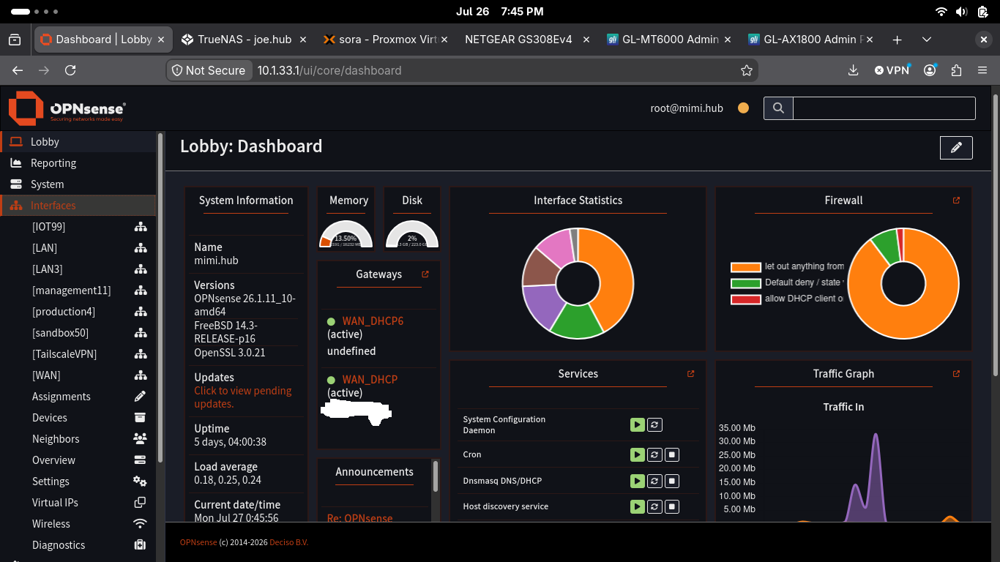

# Node Profile - mimi

hardware - intel nuc7i5bnk  
upgrades - 16gb ram 2133mhz, 256gb nvme, realtec 8156bg usb nic(LAN)  
role - gateway/firewall 
version - opnsense v26.1.11 
networks: vlan1 trunked port with 3,4,11,50,99 

---

## services: unbound dns, dnsmasq dhcp, suricata IDS

---
## key configurations: 

