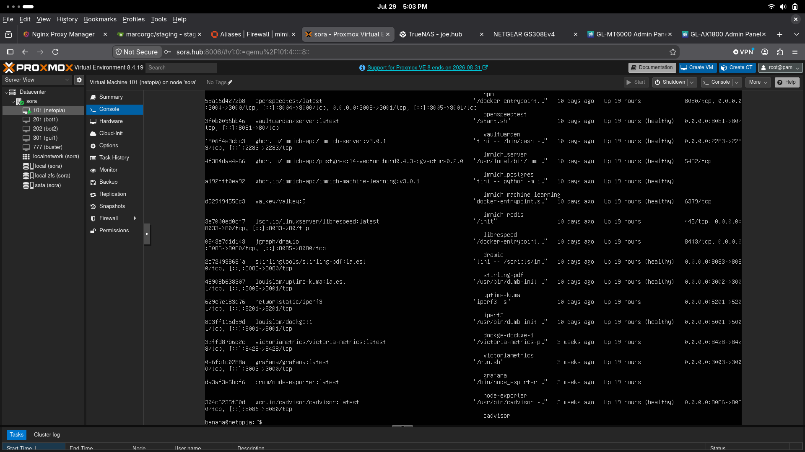

# Node Profile — Sora

**Hardware:** Lenovo ThinkCentre M75q Gen2  
**Upgrades:** 500 GB NVMe, 500 GB SATA SSD, 48 GB 3200 MHz RAM  
**Role:** Proxmox Node  
**Version:** PVE v8.2.1  
**Network:** VLAN11 (trunked ports 3, 4, 50, 99) → 10.1.11.6  

---

## Virtual Machines
- netopia (Docker VM)
- bot1
- bot2
- gui1
- win1

---

## Services on netopia
AdGuardHome, Dockge, Draw.io, Gitea, Grafana, Homarr, Immich, iPerf3, LibreSpeed, Memos,  
Nginx Proxy Manager, OpenSpeedTest, Uptime Kuma, StirlingPDF, Vaultwarden, cAdvisor, Node Exporter, VictoriaMetrics

**Key configurations:** 

---

## Purpose
This node exists because early on I found an affinity for virtualization but was limited by hardware.

---

## Future Improvements
Sandbox pentesting, LXC containers, high availability, clustering.

---

