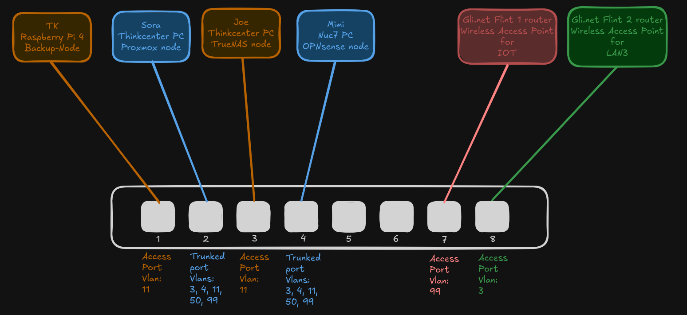
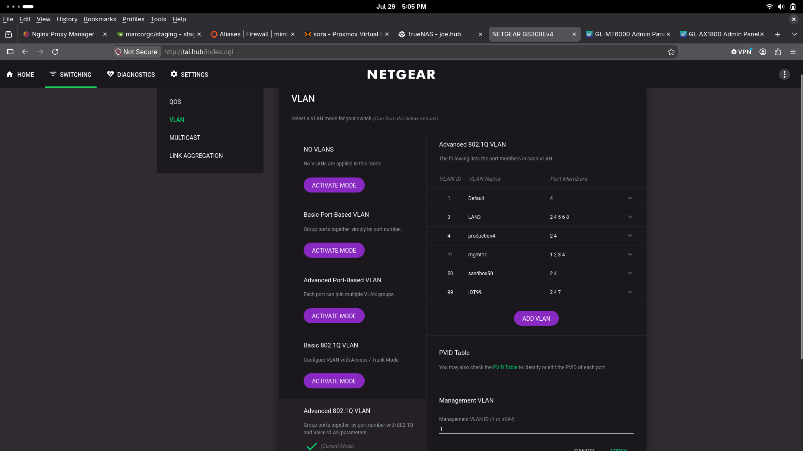
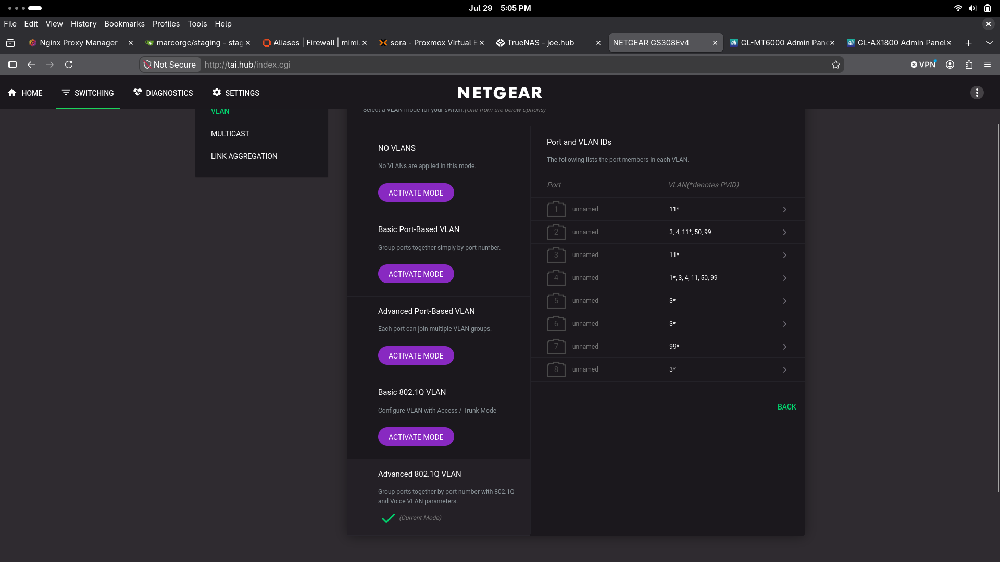

# Node Profile — Tai

**Hardware:** NETGEAR gs308e managed switch 
**Upgrades:** 
**Role:** Network Switch  
**Version:** v4  
**Network:** VLAN1 → 192.168.33.2(web ui)  

---

**Key configurations:** 

---

## Purpose
This node enforces the vlan interfaces created on OPNsense.  
provides access and trunk ports for devices as needed.

---

## Future Improvements
Document Deployment steps and configuration changes as runbooks

---

