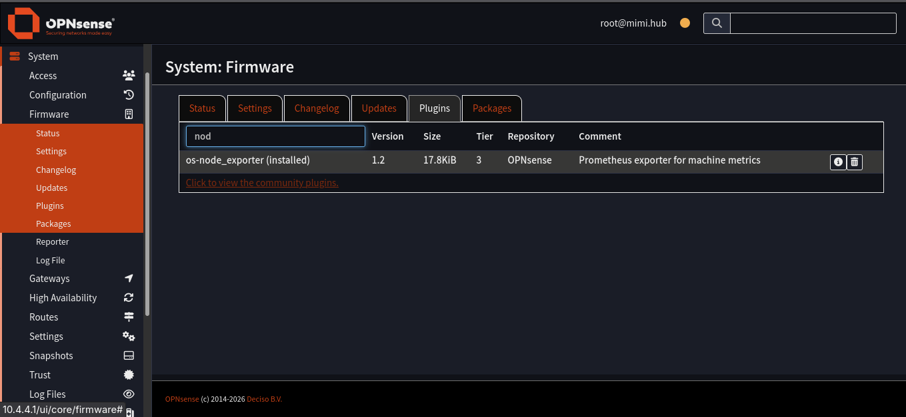
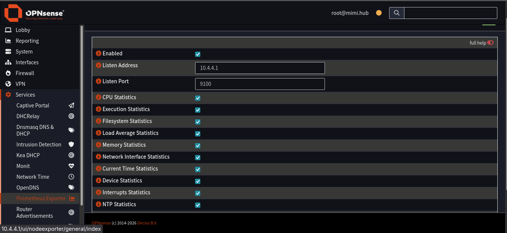

## Description
install node exporter on OPNsense node and add entry to prometheus.yml for metrics

## Purpose
to add the final node to grafana for full node visibility

##
Step 1: Download plugin
login to OPNsense web ui and navigate to Firmware > Plugins  
Make sure to click the 'Click to view the community plugins' link,  
type in the search bar node_exporter, find the listing and click download  


##
Step 2: Enable node exporter  
Navigate to Services > Prometheus Exporter and check box 'Enable'  
as well as all the metrics you want to be visible  
Listen Address: -the address you want to be able to access over the network, leave blank if you want to listen on all interfaces-  
Listen Port: 9100 # is default but you can choose any


##
Step 3: Validate
visit 
```
http://<Listen Address>:<Listen Port>/metrics  
```
or from a terminal
```
curl http://<Listen Address>:<Listen Port>/metrics 
```
and you should see output