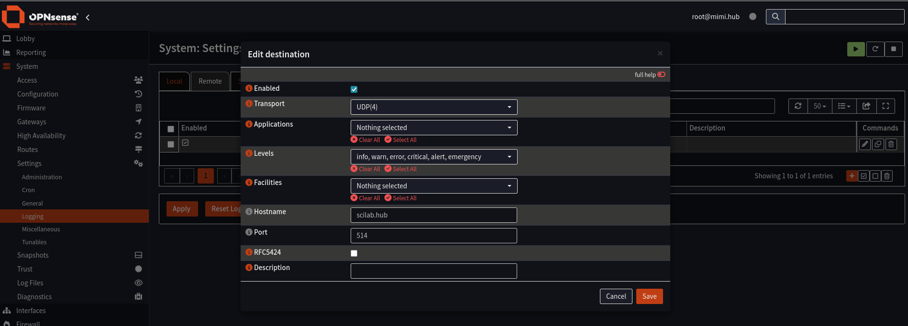
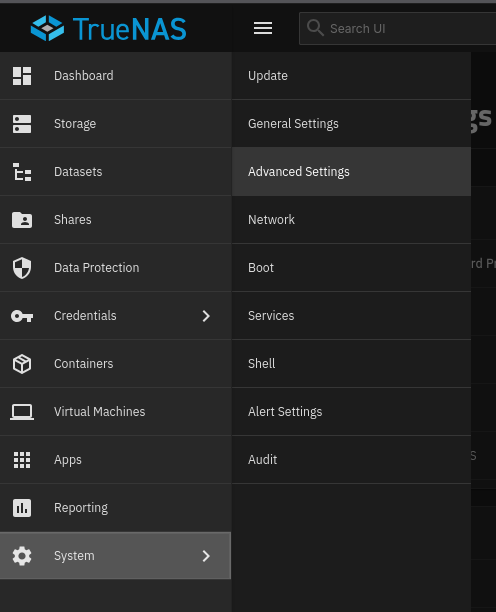
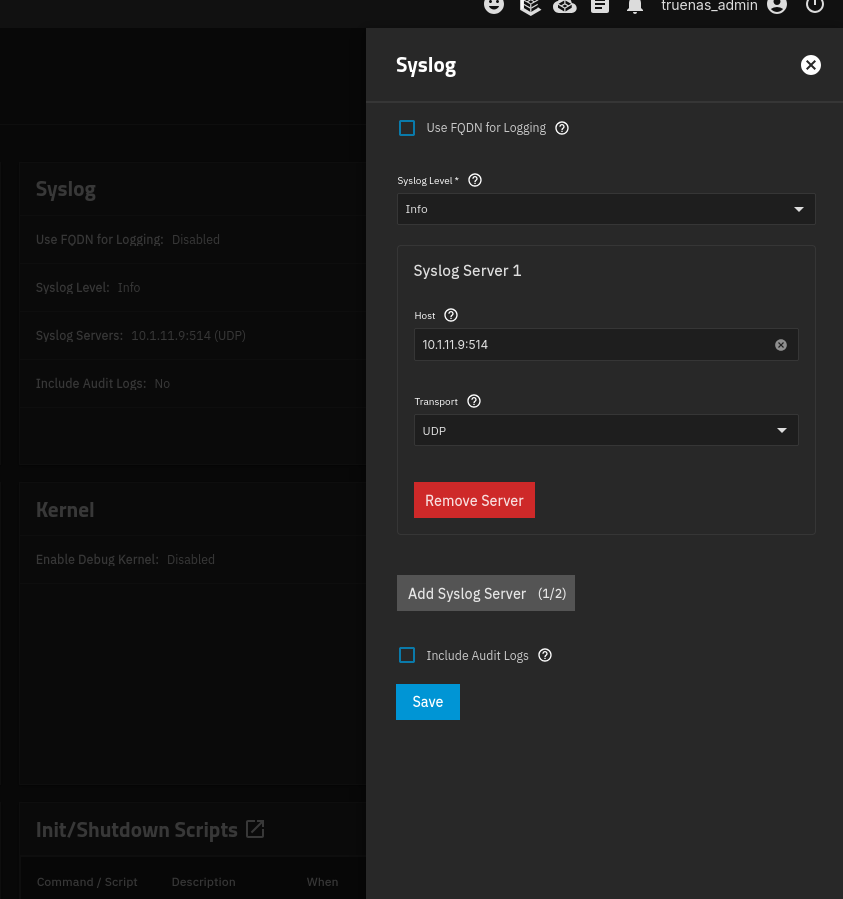
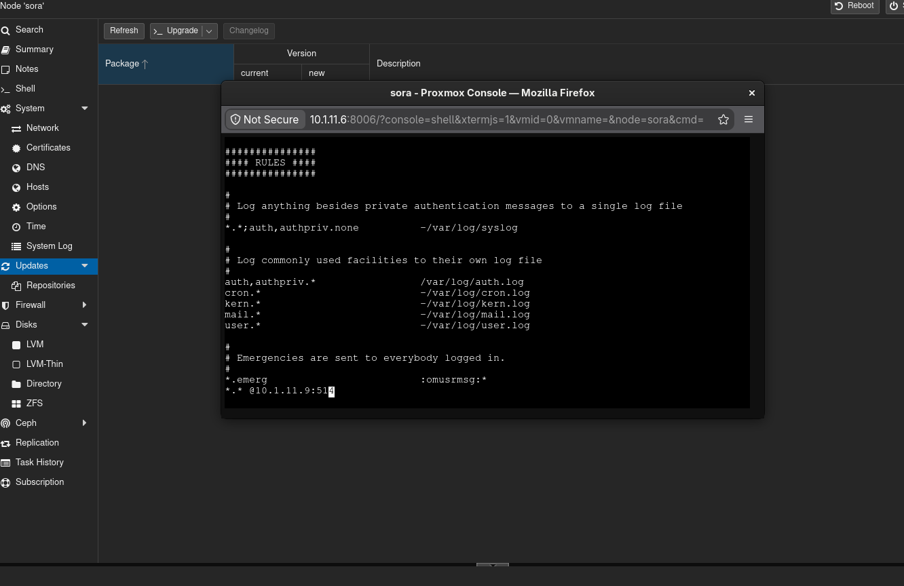

## Description
Configure nodes to send logs → scilab  
Each node forwards syslog to rpi4's IP on port 514.

##
OPNsense  

Navigate to System > Settings > Logging  
Click the Remote tab and then find the + or 'add' at the bottom right  
  
  
Here you will enter your Syslog collector's IP address and port 514(default)  
and save.

##
TrueNAS

Navigate to System > Advanced Settings  
find the Syslog box and click Configure  
  

Here you will enter your Syslog collector's IP address and port 514(default)  
and save.
  

## 
Linux

if rsyslog is not installed you must install it first
```
sudo apt update
sudo apt install rsyslog
```
  
a file in the /etc folder will appear called rsyslog.conf,  
here you will enter you SYslog collector's IP address and port number
```
sudo vi /etc/rsyslog.conf
```

  
paste in at the bottom under Rules
```
*.* @<SYSLOG COLLECTOR IP>:514
```
and save

##
now all nodes send logs to rpi4