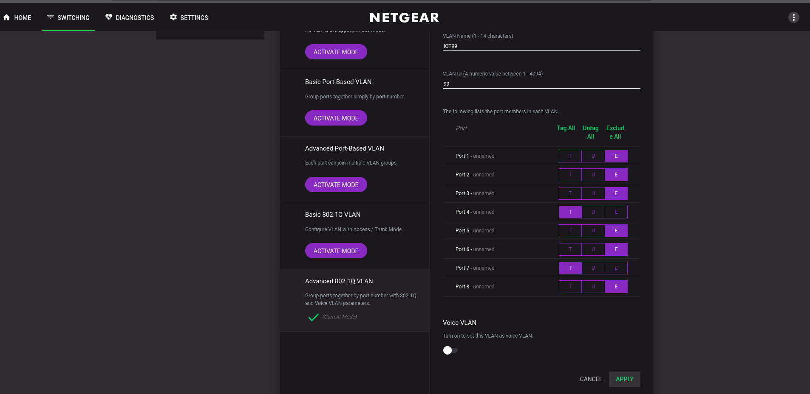

# Deploy The NETGEAR GS308EP Switch

## Purpose

Configure the managed switch with the access and trunk ports required by OPNsense,
Proxmox, TrueNAS, the Raspberry Pis, Fedora workstation, and Flint2.

This is the second part in the process of creating multi-VLAN segmented networks with a
dedicated router, switch, and wireless access point.

## Prerequisites

- OPNsense VLAN interfaces and DHCP are configured.
- A console or local recovery path is available before changing VLAN membership.
- The current port plan is reviewed in [Network Topology](../../Architecture%20Overview/network-topology.md).

## Procedure

### 1. Locate the switch management address

log into OPNsense web UI and navigate to Services > Dnsmasq DNS & DHCP > Leases  
Locate your switch's IP address  
navigate to that address in a browser  
  

The documented current management address is `192.168.33.2`.

### 2. Enable 802.1Q VLANs

log in, first log in will prompt you to change the default password  
  
at the top locate and navigate to Switching > VLAN then scroll down to Activate Advanced 802.1q VLAN  
  
then click ADD VLAN.
Name the VLAN, assign its tag, and choose which ports are tagged, untagged, or excluded.
Repeat this for VLANs 1, 4, 11, 50, 88, and 99 using the current port table below.
  

### 3. Configure VLAN membership and PVIDs

Use the current port plan rather than the historical example below:

| Port | Device | PVID | Tagged VLANs |
| --- | --- | --- | --- |
| 1 | TrueNAS | 11 | None |
| 2 | Proxmox | 11 | 1, 4, 50, 88, 99 |
| 3 | backup-node | 11 | None |
| 4 | Unused | 50 | None |
| 5 | Unused | 50 | None |
| 6 | observer | 11 | None |
| 7 | OPNsense LAN | 1 | 4, 11, 50, 88, 99 |
| 8 | Flint2 | 1 | 88, 99 |

Configure the PVID table according to the current port plan. The PVID is the untagged/native
VLAN for each port; all other listed VLANs must be tagged.
  

## Validation

With these steps in place, verify that:

- The switch management UI remains reachable from the Fedora workstation.
- Proxmox receives the expected tagged VLANs.
- Flint2 receives tagged VLANs 88 and 99 and can broadcast the intended SSIDs.
- TrueNAS, backup-node, and observer remain reachable on VLAN 11.
- The OPNsense trunk has exactly one untagged/native VLAN.

You should now be able to access the subnets configured for each physical link. The next step is to configure Flint2 as the wireless access point.