OPNsense Installation & Initial Configuration (NUC7i5BNK)

A simple runbook for installing OPNsense, creating VLAN interfaces, configuring DHCP/DNS, applying baseline firewall rules, and basic hardening.
📘 Description

OPNsense is an open‑source firewall/router operating system that runs on a wide range of hardware.
This guide covers installing OPNsense on a NUC7i5BNK, creating interfaces, assigning VLANs, configuring DNS/DHCP, applying baseline firewall rules, and performing basic hardening.
🎯 Purpose

I didn’t properly document my first OPNsense deployment, and the update from 26.1 → 26.7 changed the firewall rule system enough that I needed to rebuild everything.
This runbook documents a clean, fresh deployment of my homelab firewall/router.
⚠️ Heads‑Up

This is Part 1 of building a VLAN‑segmented network.
You will need a managed switch.
You can complete all OPNsense steps first while the switch is still at factory defaults.
🛠️ INSTALLATION

    These steps are done from the console, so no screenshots were taken.

1. Download & Flash the Installer

    Download OPNsense: https://opnsense.org/download/

        Architecture: amd64

        Image type: VGA

        Mirror: OPNsense

    Flash the .img file to a USB drive using:

        Rufus (Windows)

        BalenaEtcher (Linux)

2. Boot & Install

    Boot the NUC from USB (F10 for boot menu).

    The installer launches automatically.

    The console will show:

        The IP address for the web UI (usually 192.168.1.1/24)

        NIC assignments (auto‑detected)

Example from my system:

    em0 → LAN (native NIC)

    ue0 → WAN (USB NIC)

Connect your switch to the LAN NIC, then connect your laptop to the switch.
You should now reach the OPNsense web UI at the IP shown on the console.
⚙️ CONFIGURATION
3. Create VLANs

Navigate: Interfaces → Devices → VLAN  
Click + to add a VLAN.

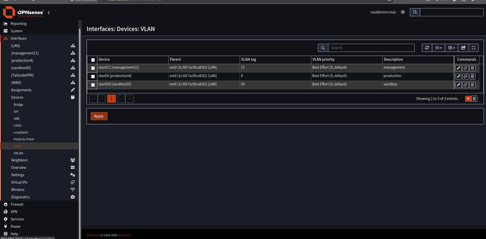

    Device: vlan0 (I match device names to VLAN tags for simplicity)

    Parent: em0 (your LAN NIC)

    VLAN Tag: 99 (example: IoT VLAN)

This creates sub‑interfaces on the parent NIC.

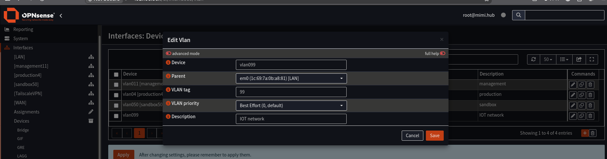
4. Assign VLANs to Interfaces

Navigate: Interfaces → Assignments  
Click + and select each VLAN you created.

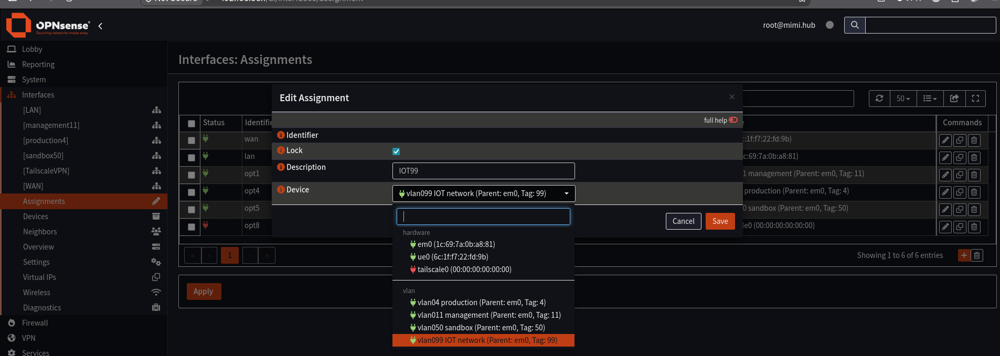

Give each interface a descriptive name (e.g., IOT99).
They will now appear in the left‑side menu under Interfaces.
5. Configure Interfaces

Navigate: Interfaces → [Your VLAN Interface]

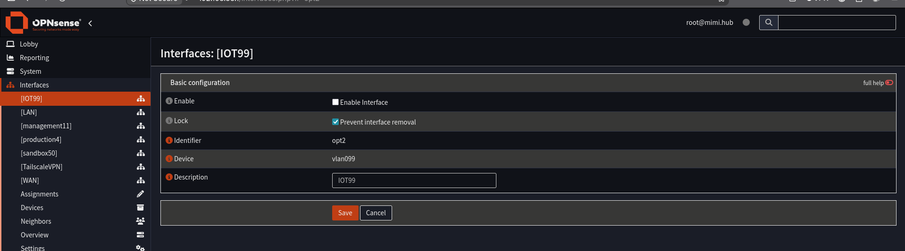

    Check Enable

    IPv4 Configuration Type: Static IPv4

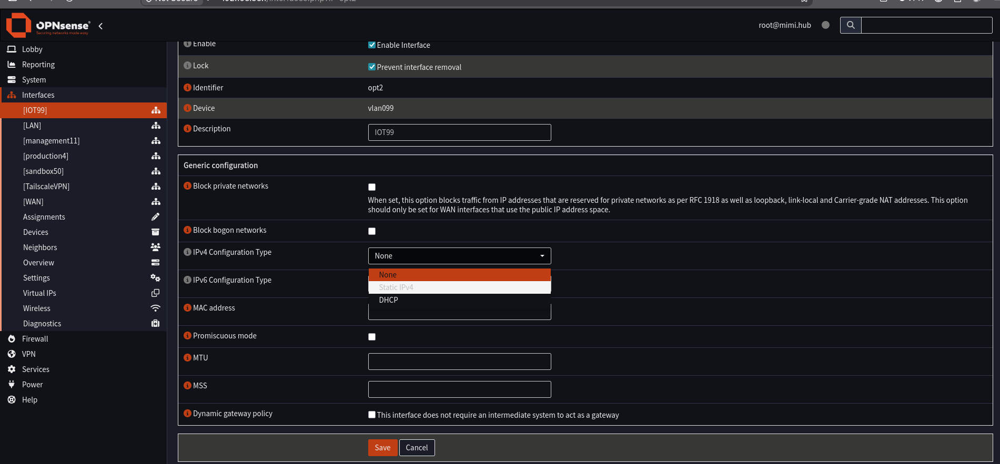

    IPv4 Address: 10.1.99.1/26 (example)

Click Save.

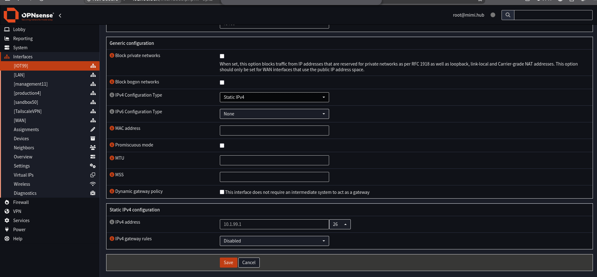
6. Configure DHCP Pools

Navigate: Services → Dnsmasq DNS & DHCP → DHCP Ranges  
Click +.

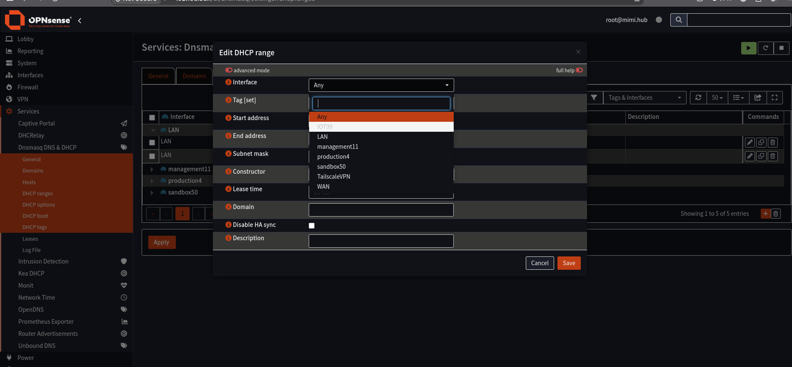

Example for VLAN 99 (10.1.99.0/26):

    Interface: IOT99

    Start: 20

    End: 62

    Subnet Mask: 255.255.255.224

    Lease Time: 43200 seconds

Click Save.
7. Baseline Firewall Rules
Create RFC1918 Alias

Navigate: Firewall → Aliases → +

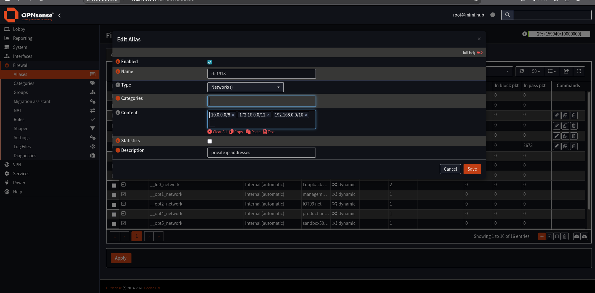

    Name: RFC1918

    Content:

        10.0.0.0/8

        172.16.0.0/12

        192.168.0.0/16

Save.
Apply Rules to Each VLAN

Navigate: Firewall → Rules → [Interface] → +

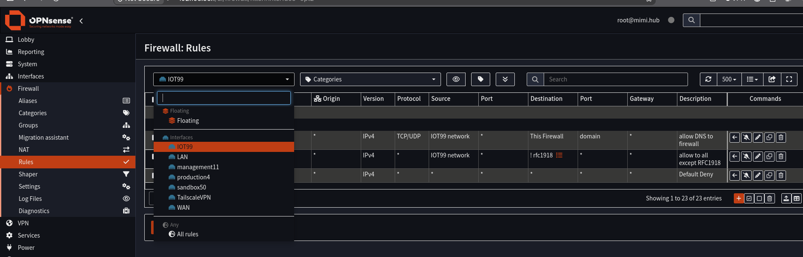

Rules (top → bottom):
Rule 1 — Allow DNS to Firewall

    Action: Pass

    Protocol: TCP/UDP

    Source: IOT99 network

    Destination: This Firewall

    Destination Port: 53

Rule 2 — Allow Internet, Block Private Networks

    Action: Pass

    Source: IOT99 network

    Invert Destination: ✔

    Destination: RFC1918

This allows internet access but blocks access to internal subnets.
Rule 3 — Deny Everything Else

    Action: Block

    Source: IOT99 network

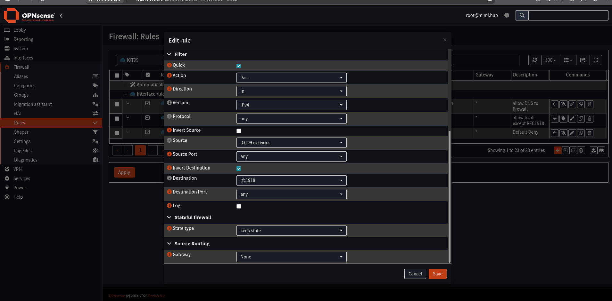

This creates a clean baseline for further tuning.
8. Basic Hardening
Block Bogons & Private Networks on WAN

Navigate: Interfaces → WAN

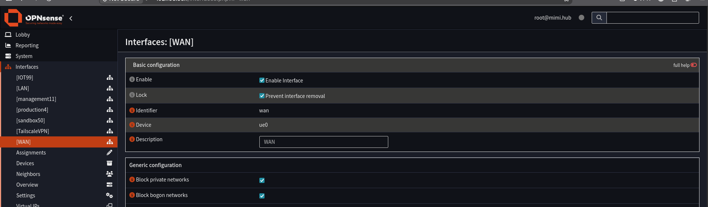

Ensure:

    Block private networks ✔

    Block bogon networks ✔

Disable SSH (Recommended)

Navigate: System → Settings → Administration

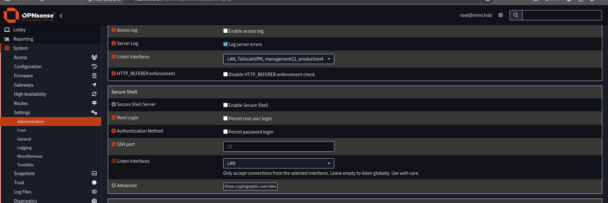

    Uncheck Enable Secure Shell

By default, SSH listens on all interfaces, including WAN.
If you must use SSH, explicitly bind it only to trusted interfaces.
Restrict Unbound DNS Listening

Unbound may listen on WAN by default.

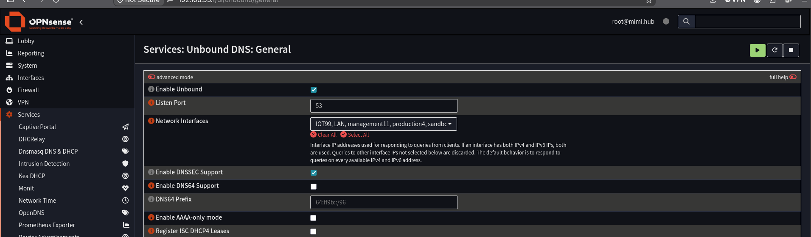

Select only the interfaces you want Unbound to serve.
➡️ Next Steps

With OPNsense configured, the next step is to configure your managed switch to propagate VLANs, followed by setting up your wireless access point.
