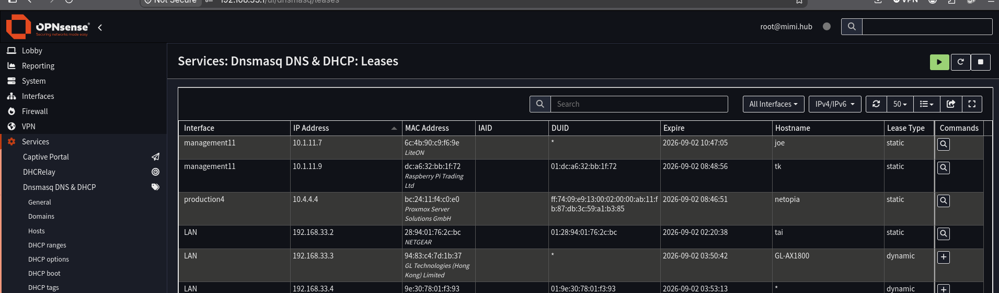
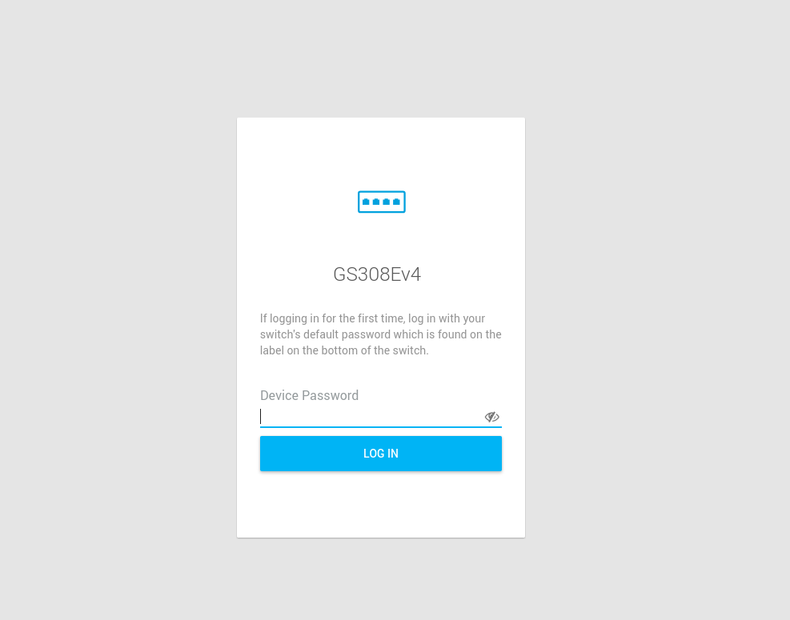
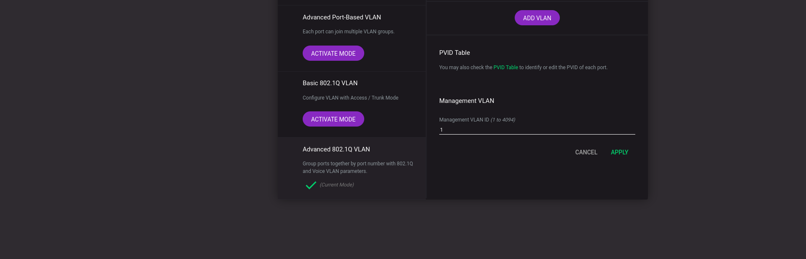
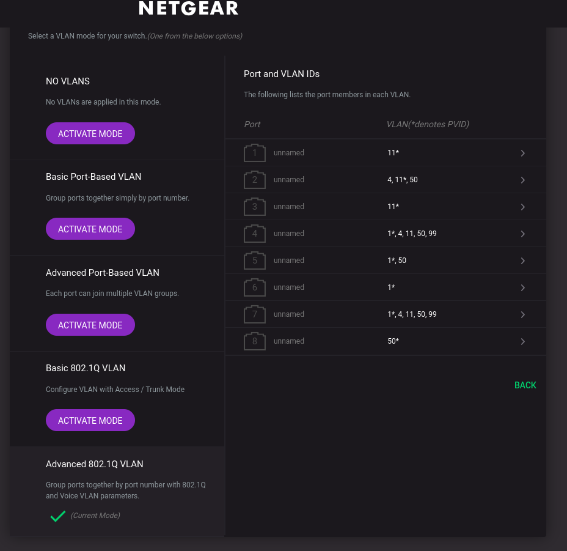

## Description
Configure Netgear gs308e Switch with trunk and access ports for vlans created on OPNsense

## Purpose
This is the 2nd part in the process of creating multi-VLAN segmented networks with  
a dedicated router, switch, and wireless access point  

step 1 locate the switch's IP address for web access in the OPNsense UI  
log into OPNsense web UI and navigate to Services > Dnsmasq DNS & DHCP > Leases  
Locate your switch's IP address  
mine is 192.168.33.2 (i created a reservation previously but you will find yours somewhere here)  
navigate to that address in a browser  
  

step 2 activate and add VLAN  
log in, first log in will prompt you to change the default password  
  
at the top locate and navigate to Switching > VLAN then scroll down to Activate Advanced 802.1q VLAN  
  
then click ADD VLAN  
here you will name your VLAN and assign it a tag, as well as choose which ports you would like the  
tag to be tagged, untagged, or excluded. in my case;  
VLAN name: IOT99  
VLAN ID: 99  
port 4: tagged (opnsense)  
port 7: tagged (wireless access point)  
  

step 3 trunk and access ports  
you will have had to have previously thought out your switch port layout before beginning to configure  
the pvid table. in this example i am just adding a tagged vlan to trunked ports for the router and wap  
so that the wap can broadcast the newly added IOT99 network.  
you can refer to this for my final switch port layout [switchport layout](homelab/Nodes/switch.md)  
  

with these steps in place you should now be able to access whatever subnets you've configured  
to be available through physical links in your switch, the final step is to configure a  
wireless access point to be able to access your networks through WiFi!