1. Connect Flint2 and Access Its UI

    Plug Flint2 into a switch port configured with:

        PVID 1

        Tagged VLANs 88 and 99

    Locate Flint2’s IP address in the OPNsense UI.

    Navigate to Flint’s web UI.

    Go to Network > Network Mode and choose Access Point.
    Flint will now receive DHCP from OPNsense and its IP will change.

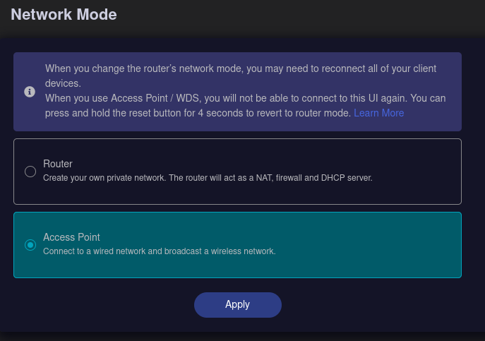

    Navigate to Flint’s new IP.

    Go to System > Advanced Settings and install LuCI.

    Open the LuCI interface and log in.

2. Create VLAN Devices

    In LuCI, go to Network > Interfaces.

    Select the Devices tab.

    Click Add device configuration.

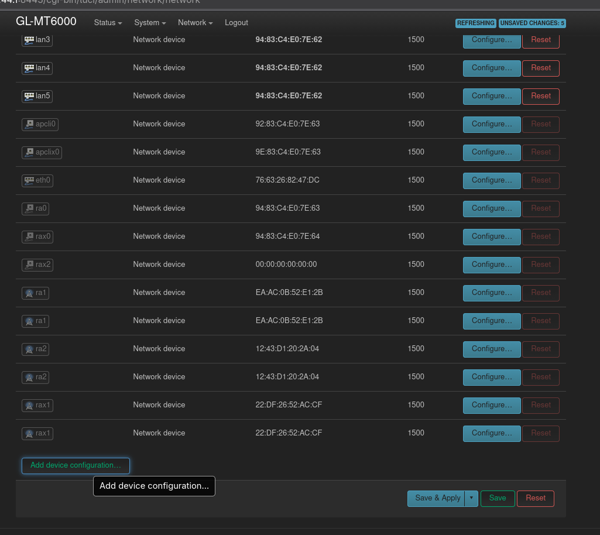

    Set:

        Device Type: VLAN (802.1q)

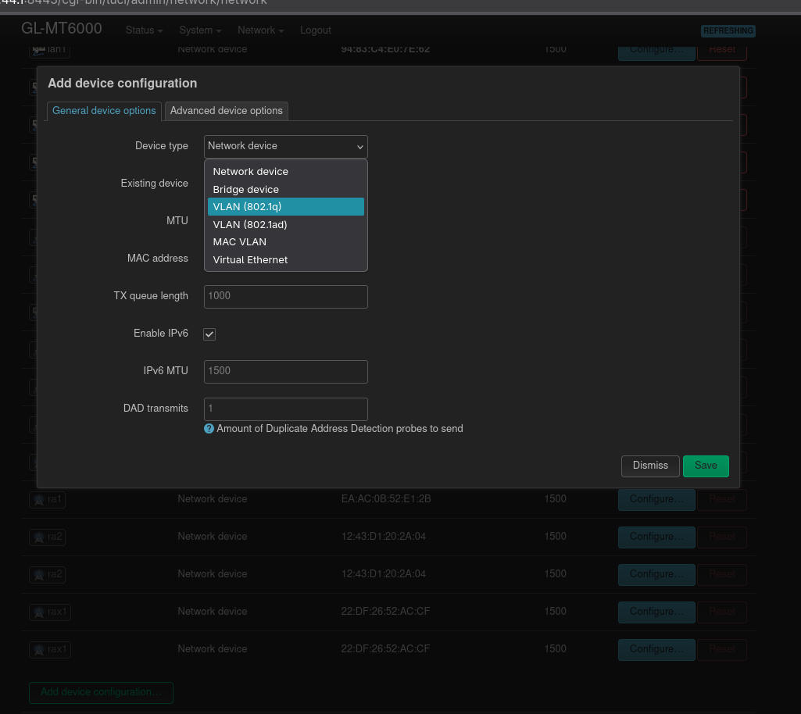

    VLAN ID: 88 (or whatever tag you need)

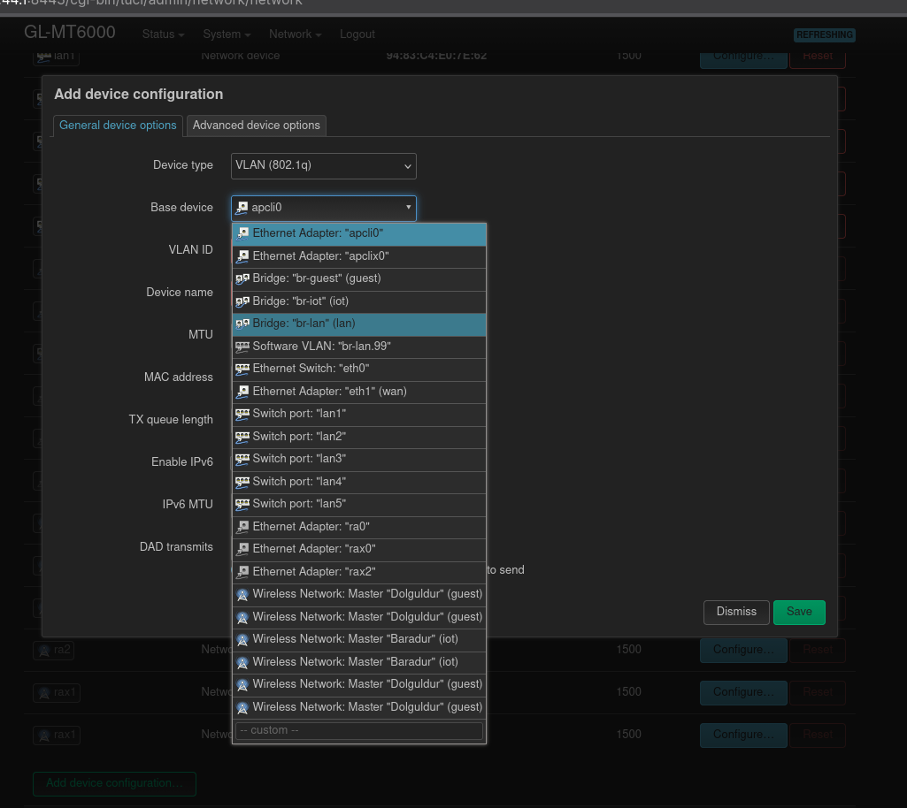

    Click Save, then Save & Apply.

3. Create Interfaces for Each VLAN

    Go back to the Interfaces tab.

    Click Add new interface.

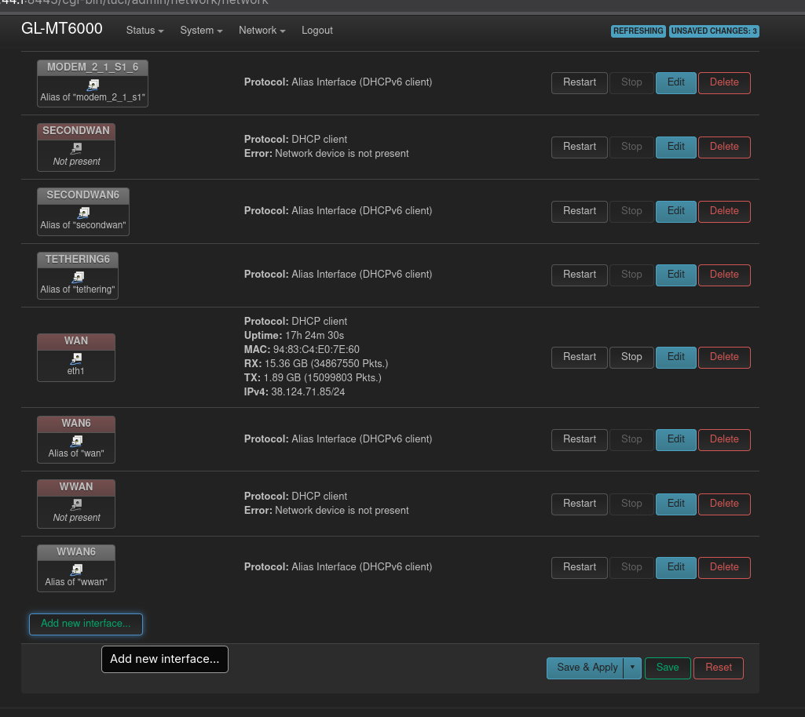

    Set:

        Name: IOT99 (example)

        Protocol: Unmanaged

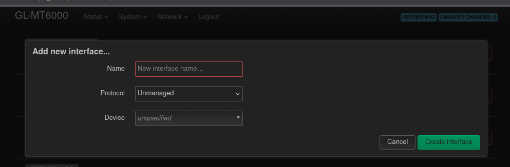

    Device: Software VLAN br-lan.99

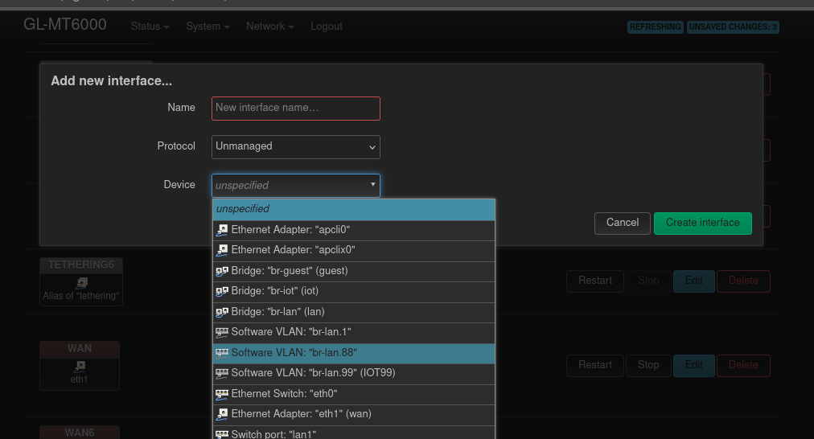

    Click Create interface.

4. Configure Bridge VLAN Filtering

    Return to the Devices tab.

    Find br‑lan and click Configure.

    Open the Bridge VLAN Filtering tab.

    Enable Bridge VLAN Filtering.

    Add VLANs as needed.
    Example for LAN1 input:

        VLAN 1: untagged

        VLAN 88: tagged

        VLAN 99: tagged

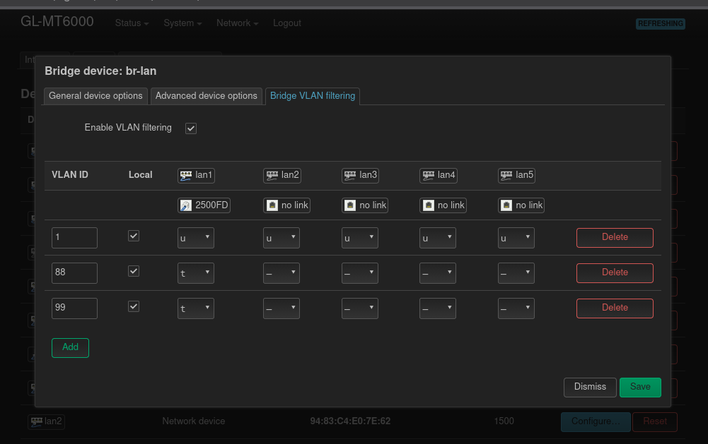
5. Create Wi‑Fi SSIDs for Each VLAN

    Go to Network > Wireless.

    Find the 5 GHz radio and click Add.

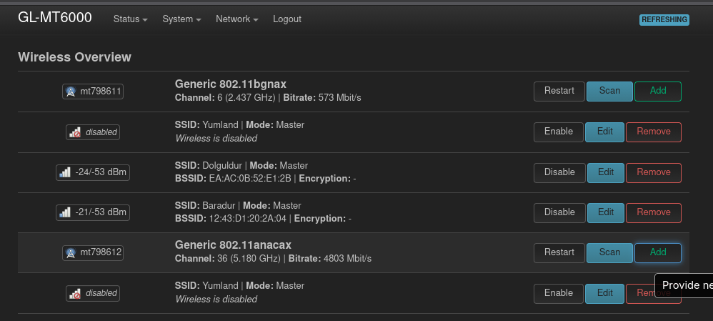

    Set:

        ESSID: IOT99

        Network: IOT99

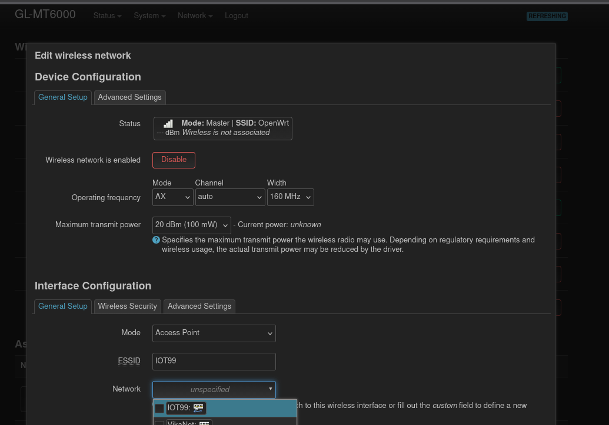

    Go to the Wireless Security tab.

    Choose encryption (example: WPA2‑PSK).

    Enter your Wi‑Fi password.

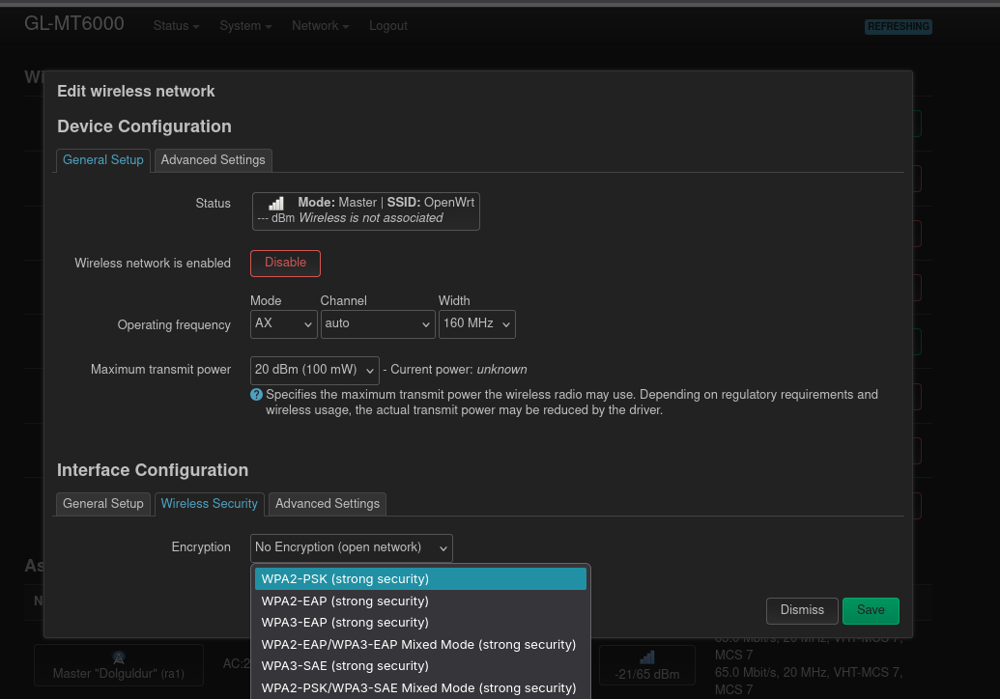

    Click Save.