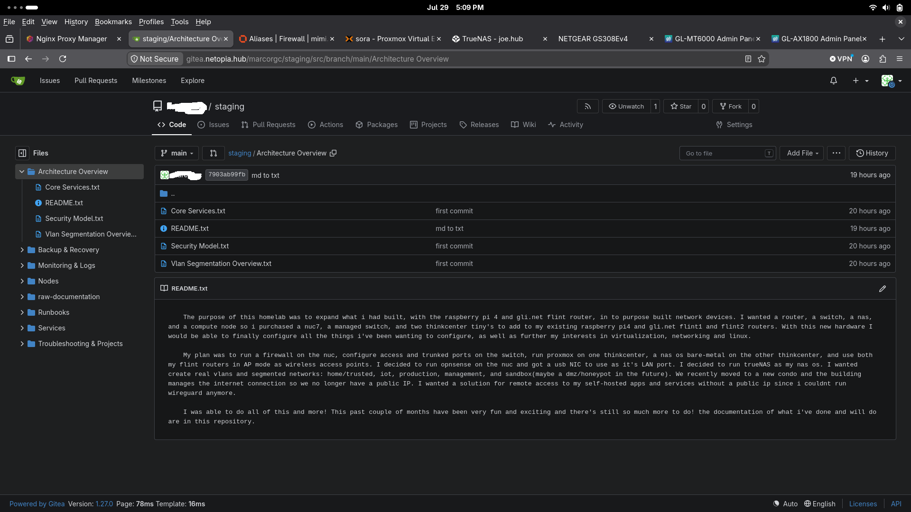

## gitea 

- self-hosted git server for configs, scripts, and a staging area for github pushes
- running on docker VM(netopia)
- exposed through nginx proxy manager
- accessible from LONS and izzy only, local or remote(tailscale)

