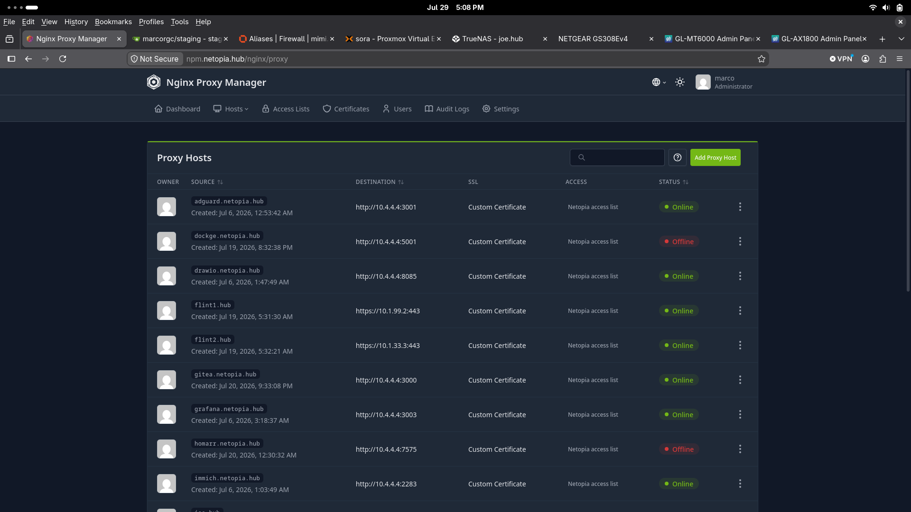
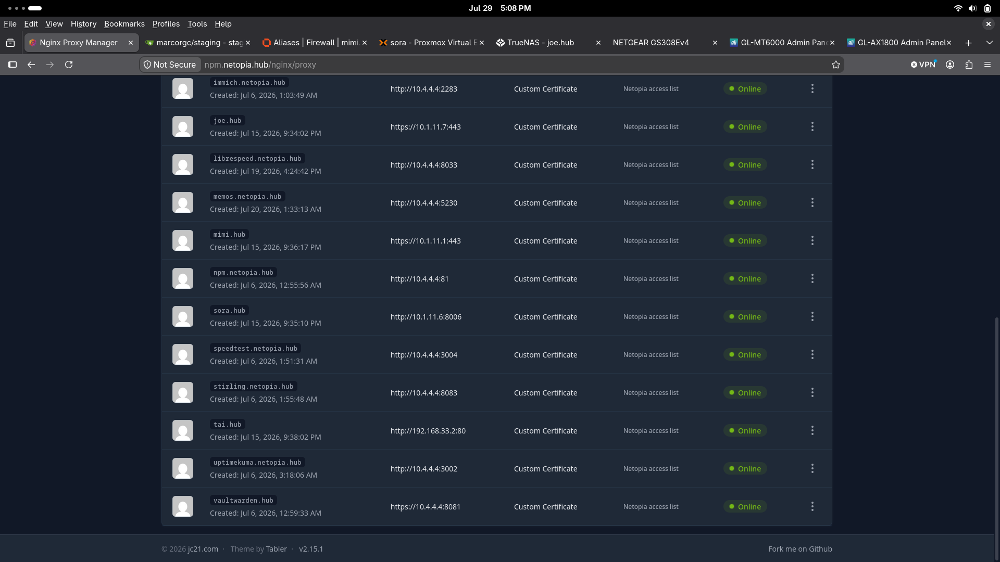

## nginx proxy manager 

- reverse proxy server terminating https connections for my web apps and management ui's
- running on docker VM(netopia)
- exposed through nginx proxy manager
- accessible from LONS and izzy only, local or remote(tailscale)
- selfsigned wildcard cert for self-hosted apps
- access list restricted to phone, workstation and management hosts

