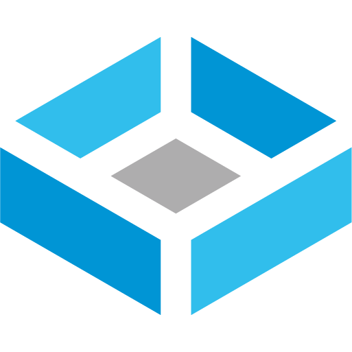
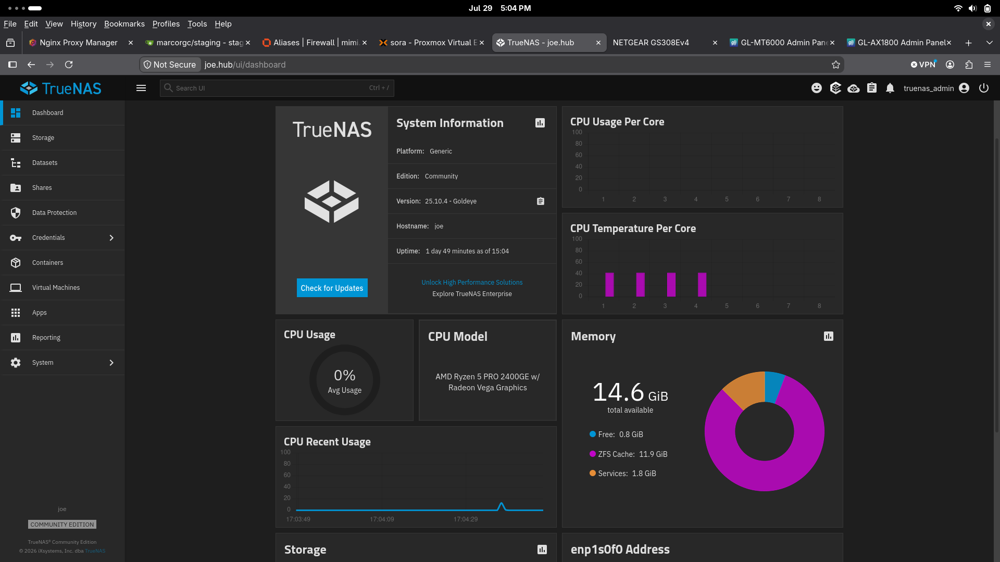

## trueNAS 

- NAS operating system running directly on a thinkcentery tiny providing network storage
- web ui exposed through nginx proxy manager
- web ui accessible from workstation with local connection only
- access to SMB shares allowed only to LONS, izzy, and raspberry pi4 backup-node
- access to NFS share allowed only to docker VM(netopia) and raspberry pi4 backup-node

