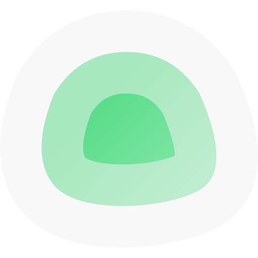

## uptime-kuma 

- self-hosted service monitoring application providing uptime visibility and service outage alerts
- running on docker VM(netopia)
- exposed through nginx proxy manager
- accessible from LONS and izzy only, local or remote(tailscale)
- monitor down alerts sent to phone via Discord

